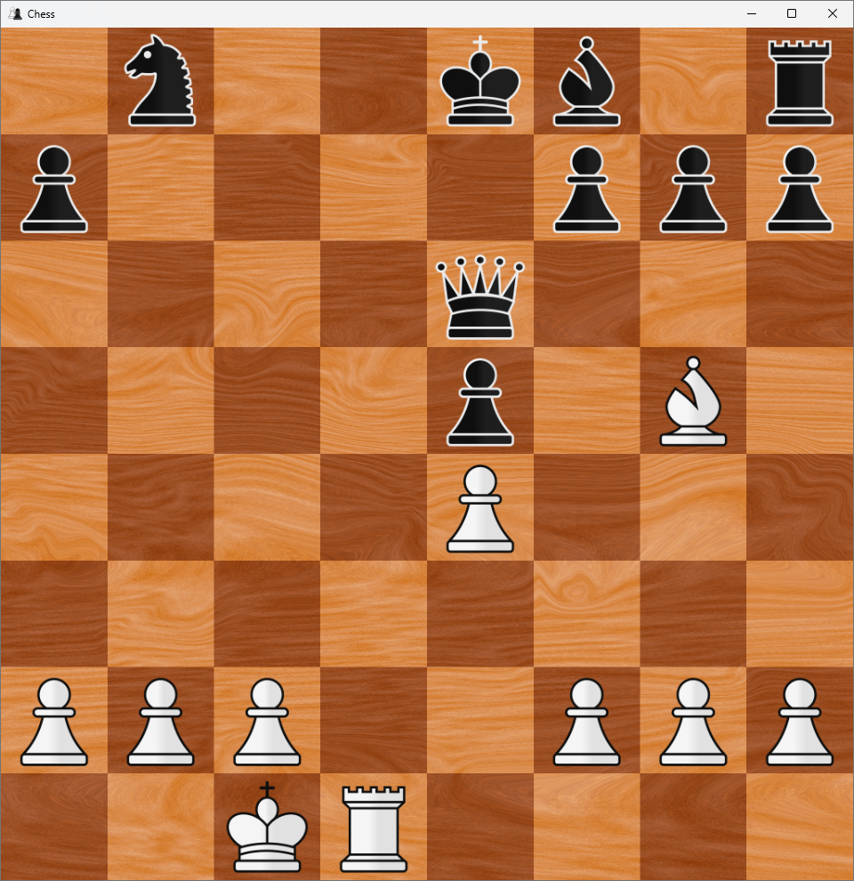

# ♟️ C# WPF Chess Application

> A robust, structurally separated, and deeply validated Chess Engine and Presentation Layer built in C# and WPF.

## 🌟 Core Features

- **Strict Rule Engine Validation**: Fully enforces FIDE chess laws, including move constraints, check validation, and end-game criteria.
- **Advanced Special Moves**: Perfected logic for En Passant captures, Castling rights (King-side and Queen-side), and Pawn Promotion branching.
- **Endgame Detection**: Precise algorithms for detecting Checkmate, Stalemate, 50-Move Rule, Threefold Repetition, and Insufficient Material draws.
- **State History Tracking**: Deeply integrated move history and position tracking utilizing FEN-like state string generation.
- **Presentation Layer Separation**: Clean UI/Logic decoupling ensuring the pure C# rule engine (`ChessLogic`) can operate independently from the WPF frontend (`ChessUI`).

## 🏗️ Visual System Architecture

The project is strictly divided into two primary domains, isolating the rules engine from the user interface:

### 1. `ChessLogic` (Pure C# Class Library)
The core engine. It has zero knowledge of the WPF UI and handles all mathematical validations.
- **`GameState.cs`**: The master orchestrator. Controls turn transitions, move generation tracking, and end-game triggers.
- **`Board.cs`**: The spatial data structure. Tracks piece locations, En Passant skip positions, and handles board state cloning for legality checks.
- **`Moves/`**: Abstracted move types (`NormalMove`, `Castle`, `EnPassant`, `DoublePawn`, `PawnPromotion`) encapsulating their specific execution and legality logic.
- **`Pieces/`**: Inherited piece definitions detailing individual move vectors and capture capabilities.

### 2. `ChessUI` (WPF Presentation Layer)
The graphical interface. It purely reacts to the state provided by `ChessLogic`.
- **`MainWindow.xaml.cs`**: Manages the grid interactions, maps pixel coordinates to board positions, and maintains a cached dictionary of legal moves for visual highlighting.
- **Event-Driven Menus**: Asynchronous-style UI pauses for Pawn Promotion (`PromotionMenu.xaml`) and Game Over states (`GameOverMenu.xaml`).

## 🚀 Execution & Setup Guide

### Dependencies
- **.NET 8.0 SDK** (or compatible .NET Core framework version).
- **Windows OS** (Required for WPF presentation layer).
- Visual Studio 2022 (Recommended) or Rider.

### Build Workflows
1. Clone the repository and navigate to the root directory.
2. Open `chess.slnx` in your preferred IDE.
3. Set **`ChessUI`** as the Startup Project.
4. Restore NuGet packages (if any).
5. Build the Solution (`Ctrl + Shift + B`).
6. Run the application (`F5`).

## 🔮 Future Roadmap (Phase 2: AI Integration)

The current infrastructure sets a perfect foundation for Phase 2: An automated AI opponent. 
Because `ChessLogic.Board` implements a deep `Copy()` method and `Move.IsLegal()` utilizes simulated future states, the architecture is primed for:
- **Minimax Search Algorithm**: Traversing the `GameState.AllLegalMovesFor()` tree to evaluate future positions.
- **Alpha-Beta Pruning**: Optimizing the search tree by eliminating branches that guarantee worse outcomes.
- **Board Evaluation Metrics**: Scoring piece values, central control, and king safety in the terminal nodes.
